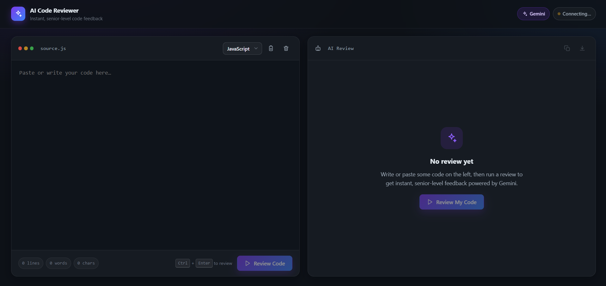
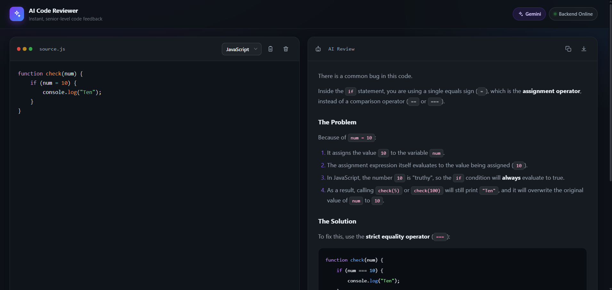

<p align="center">
  
</p>

<h1 align="center">🤖 AI Code Reviewer</h1>

<p align="center">
  AI-powered code review assistant built with React, Node.js, Express & Google Gemini AI.
</p>

<p align="center">


<a href="https://git.io/typing-svg">
    
  </a>
</p>


<!-- Add Tech Badges -->
<p align="center">
  
  
  
  
</p>


<!-- Add Live Demo Buttons -->
<p align="center">
  <a href="ai-code-reviewer-kappa-gilt.vercel.app">
    
  </a>

  <a href="https://github.com/Swarnika-Jaiswal/AI-Code-Reviewer">
    
  </a>
</p>


<!-- Add Overview -->
 
---

## 📌 Overview

AI Code Reviewer is a full-stack web application that uses Google Gemini AI to analyze source code and provide intelligent feedback on code quality, performance, security, readability, and best practices. It helps developers identify issues and improve their code with actionable suggestions.


<!-- Add Features -->
---

## ✨ Features

- 🤖 AI-powered code review
- 🔒 Security analysis
- ⚡ Performance suggestions
- 🐞 Bug detection
- 💡 Best practice recommendations
- 📝 Markdown-based review output
- 📱 Responsive user interface


<!-- Add Screenshots -->
---

## 📸 Screenshots

### 🏠 Home



### 🤖 AI Review




<!-- Tech Stack -->
---

## 🛠️ Tech Stack

**Frontend**
- React
- Vite
- Axios
- Prism.js

**Backend**
- Node.js
- Express.js
- Google Gemini AI API

**Deployment**
- Vercel
- Render


<!-- Installation -->
---

## ⚙️ Installation

```bash
git clone https://github.com/Swarnika-Jaiswal/AI-Code-Reviewer.git

cd backend
npm install
npm run dev

cd ../frontend
npm install
npm run dev
```


<!-- Project Structure -->
---

## 📁 Project Structure

```text
AI-Code-Reviewer/
├── assets/
├── backend/
├── frontend/
├── screenshots/
└── README.md
```


<!-- Author -->
---

## 👨‍💻 Author

**Swarnika Jaiswal**

⭐ If you found this project useful, consider giving it a star on GitHub.
